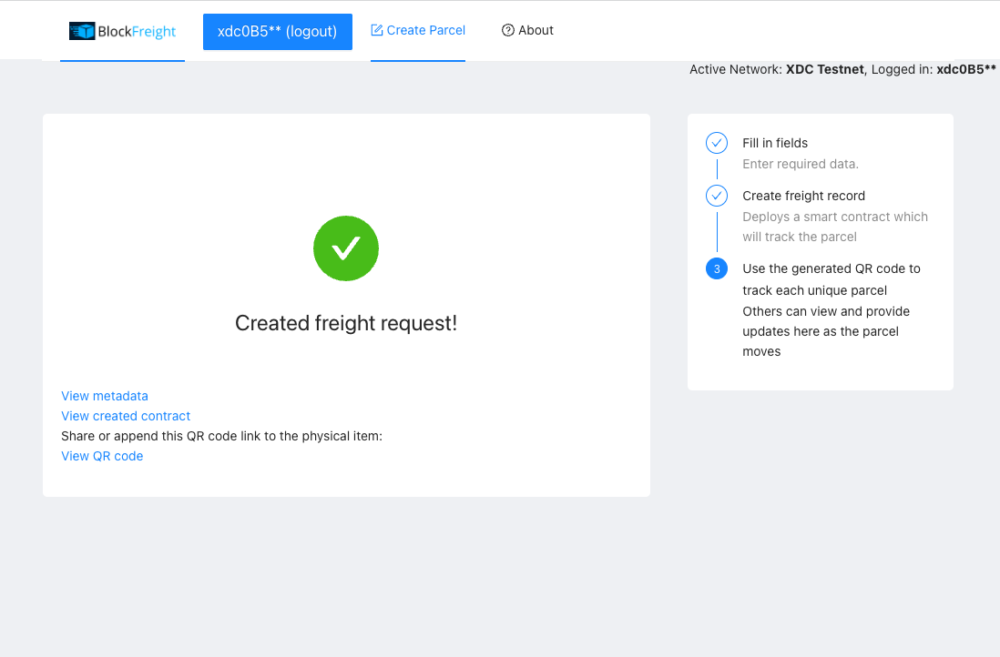
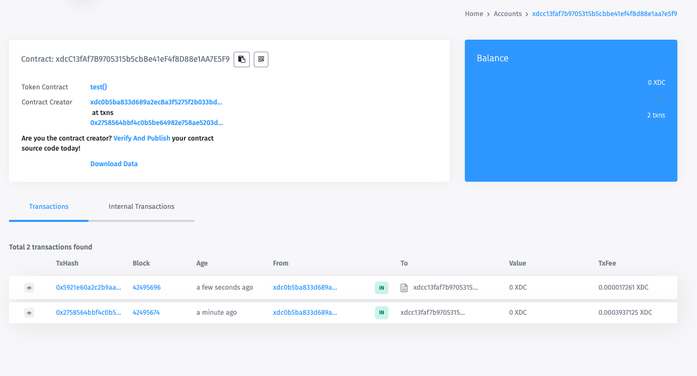
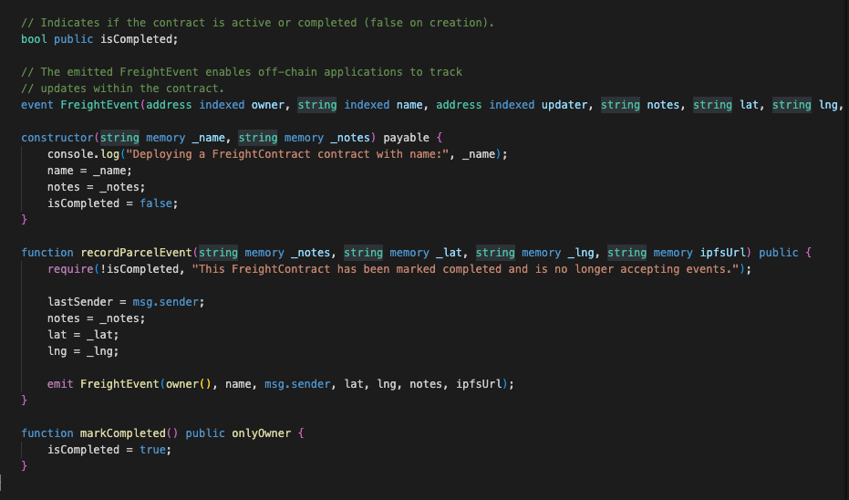
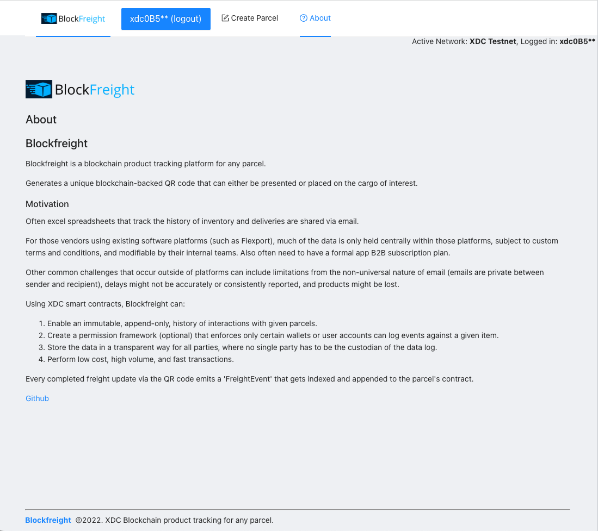

 

    

 

Blockfreight
---

Blockfreight is a XDC blockchain product tracking platform for any parcel.

Generate unique blockchain-backed QR codes that can either be presented or placed on the cargo of interest.

Built for the <a href="https://xdc.devpost.com" target="_blank">XDC Defi 2022 hackathon.</a>

Supports both testnet and mainnet contract deployments.

Demo video: https://youtu.be/kPAAVL1GLqo

Deployed with mainnet here url: https://blockfreight.surge.sh/create

Going after the best ported Dapp to XDC prize category and designed to work as a light blockchain-based package tracking platform similar to apps like Flexport.

### Motivation

Often excel spreadsheets that track the history of inventory and deliveries are shared via email.

For those vendors using existing software platforms (such as Flexport), much of the data is only held centrally within those platforms, subject to custom terms and conditions, and modifiable by their internal teams. Also often need to have a formal app B2B subscription plan.

Other common challenges that occur outside of platforms can include limitations from the non-universal nature of email (emails are private between sender and recipient), delays might not be accurately or consistently reported, and products might be lost.

Using XDC smart contracts, Blockfreight can:
1. Enable an immutable, append-only, history of interactions with given parcels.
2. Create a permission framework (optional) that enforces only certain wallets or user accounts can log events against a given item.
3. Store the data in a transparent way for all parties, where no single party has to be the custodian of the data log.
4. Perform low cost, high volume, and fast transactions.

### Technologies used

**XDC**: Serves as the primary smart contract network for the Blockfreight application. XDC enables fast and low cost smart contract transactions that make it easy to use Blockfreight in the field without heavy additional costs or time delays.

**IPFS**: Record keeping and storage. IPFS is used as the backend for the QR code scanning data lookup and enables uploading new images of the cargo at different checkpoints or if the status of the item has changed visibly during transit (ex: item experienced damage). Notes uploaded are also saved to the contract.

Every completed freight update via the QR code emits a `FreightEvent` that gets indexed and appended to the parcel's contract.

<pre>
    emit FreightEvent(_requestId, lastSender, lat, lng, notes, _location);
</pre>

### Useful links
* Hardhat: https://hardhat.org/tutorial/writing-and-compiling-contracts
* Hackathon: https://chainlinkfall2022.devpost.com/
* Common supply chain / shipping problems: https://www.bluecart.com/blog/common-shipping-issues

### Running the app

Define the follow environment variables.

<pre>
    REACT_APP_STORAGE_KEY=  // Your web3.storage key (for file storage).
    REACT_APP_ACTIVE_CHAIN_ID= // 51 or 50 currently for xdc testnet or mainnet (defaults to mainnet).
</pre>

`yarn; yarn start`

Blockfreight should now be running on port 3000.

### Potential future work
* Add subscription costs for creating different record types, auditing, and organization permissioning.
* Enable data export of blockchain logs to more native or traditional formats such as excel or pdf.
* Add support for user logins in addition to metamask (or wallet-based) logins.

### Home page

## Screenshots / User flow

### Creating a new parcel contract

### Connecting wallet for contract deployment

### Contract created!

### IPFS-managed parcel images and updates.

### Contract Metadata (hosted on IPFS, immutable record after creation)

### QR code

### Printing QR code

### Providing a freight contract update from the QR code page

### Viewing freight update history on the XDC smart contracct

### Smart contract code snippet

### About page

<!--

Demo flow:
Web Article stating problem (flexport)
- https://www.flexport.com/
- https://www.bluecart.com/blog/common-shipping-issues
Intro solution / website
Connect wallet
Create blockfreight
- Original box image (IPFS/Filecoin for persistent, decentralized storage.)
Show deployed contract (XDC, good for high volume packages or shipments)
- Show QR Code
- Print screen/preview
Send a contract update with notes.
- Damaged box image
Show contract event emitted from contract and new transaction.
Show contract history.
Closing (github+future work)

Make smart contract transaction at a checkpoint scan.

Social good idea

(e.g., sustainability, tackling the energy & logistic crises, preventing misinformation). Teams may create an oracle for Filecoin Green data, use Arbol data or build tools to establish information provenance.

-- Sponsors--
Smart contract for delivery or record keeping
XDC: Low cost smart contract transactions
IPFS: Record keeping and storage

-->

